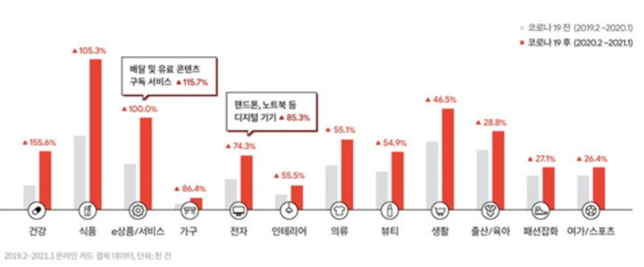
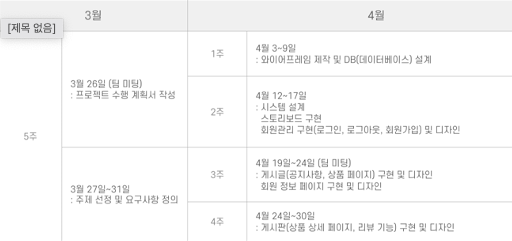
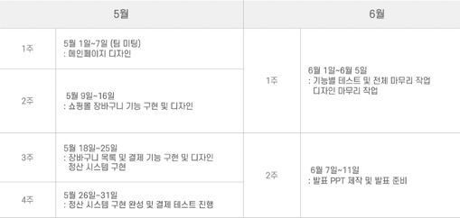
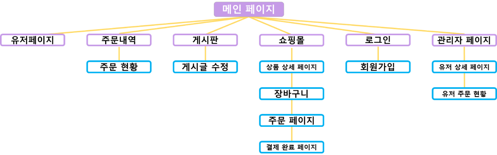
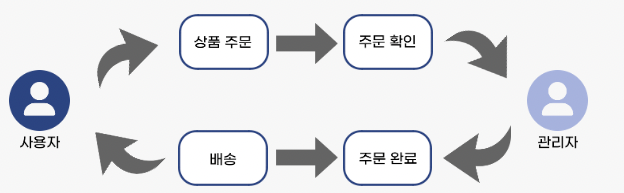
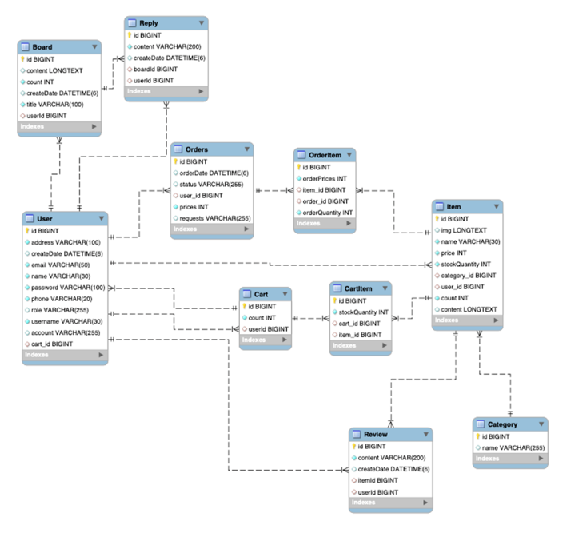
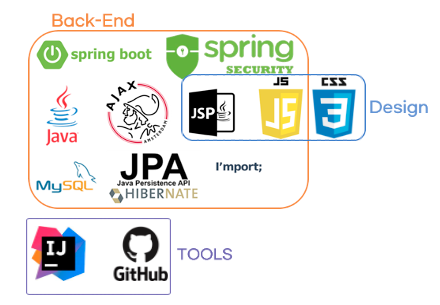

## 프로젝트 명

Genie Market

---

### 프로젝트 기간

2022.03.16 ~ 2022.06.12

---

### 프로젝트 소개
코로나로 인해 먹거리나 생필품 등 각종 장보기 상품의 온라인을 통한 비대면 쇼핑이 보편화되었다.

또한 건강식품 소비에 대한 인식이 높아지고 소비자들이 유기농 식품에 대한 관심이 많아졌다.

유기농 식품들을 집중적으로 다루는 유기농 식품 사이트의 필요성을 느끼게 되고, 이러한 수요에 맞춰 사용자에게 보다 편리한 랜선 장보기 서비스를 보여주기 위해 프로젝트를 제작하였다.

---

### 프로젝트 목적
- 온라인 장보기의 수요가 증가하면서 사용자 니즈에 맞춘 온라인 판매 서비스를 제공하는 것
- 간단한 UI를 통해 사용자에게 쉬운 접근성
- 사용 편리성을 줄 수 있는 쇼핑 서비스를 제공
- 프로젝트를 하면서 전체적인 기술역량을 증진시킬 수 있는 기회를 가짐

---

### 시장 조사

2019년 2월부터 2021년 3월까지의 온라인 카드 결제 데이터 분석 결과 온라인 쇼핑 결제 건수와 거래 금액은 해당 기간동안 꾸준히 증가하였다.

---

### 요구 분석
**왜 필요한가?**

- 시장조사로 보아 온라인 음/식료품 소비가 매우 증가하여 쇼핑몰 중에서 식품 쇼핑몰이 필요하다고 판단하였다.
  → 그 중 유기농 제품 소비는 지속가능성 환경과 건강한 식량 생산 사이클에 투자하는 것이기 때문에 ‘유기농 식품 쇼핑몰'로 제작하였다.

**현재 방향성**

- 온라인으로 구매/소비가 가능한 식자재 쇼핑몰을 개설하고 타쇼핑몰과의 경쟁성을 얻기 위해 차별점을 고려해야 함

**미래 방향성**

- 소비자들이 온라인에서 식자재를 구매하지 않는 이유가 신선도와 품질을 확신할 수 없기 때문이어서 판매자가 직접 유기농 식자제품을 판매하고 소비자들과 의사소통이 바로 가능한 온라인 직거래 개념으로 방향성 검토

**얻고자 하는것**

온라인 상으로 소비자들이 구매를 할 때 게시판 기능을 이용한 판매자와 구매자의 빠른 피드백으로 높은 신뢰도와 안전성을 기대할 수 있으며, 판매자는 제품의 품질과 신선도를, 구매자는 유기농 식자재를 구매하는데 있어서 보다 더 나은 정보와 신뢰성을 얻을 수 있을 것이다.

---

### 개발 일정

---

### 사이트맵

---

### 상품 주문 프로세스

---

### E-R 다이어그램

---

## 구현 기능

### 회원 기능

1. 회원 가입 (이름, 아이디, 패스워드, 핸드폰번호, 이메일, 주소) ☑️
2. 회원 수정 (핸드폰번호, 이메일, 주소) ☑️
3. 회원 탈퇴 ☑️
4. 로그인 ☑️

### 게시글 기능

1. 게시글 작성(제목, 내용) ☑️
2. 게시글 수정 ☑️
3. 게시글 삭제 ☑️
4. 게시글 검색 ☑️

### 댓글 기능

1. 댓글 작성(내용) ☑️
2. 댓글 수정 ☑️
3. 댓글 삭제 ☑️

### 쇼핑몰 기능

1. 주문 ☑️
2. 결제 ☑️
3. 주문 취소 ☑️
4. 장바구니 기능 ☑️
5. 구매 확정 ☑️
6. 환불 ☑️
7. 상품 검색 ☑️

### 셀러 기능

1. 상품 등록 ☑️
2. 주문 확정 ☑️
3. 배송 시작 ☑️

### 관리자 기능

1. 셀러 지정 ☑️
2. 셀러별 판매내역 확인 ☑️
3. 회원별 구매내역 확인 ☑️
4. 회원 정보 관리 ☑️

---

### 사용 기술

* Spring Boot 2.6.4
* JPA
* MySQL Server 8.0
* JSP

---

### 팀원 역할

* 백엔드 : 신재권
* 디자인 : 채민주, 안주영, 박채윤, 임수영

---

### 포트폴리오 
https://tartan-plot-7ea.notion.site/6d38dc42c1b040789e16c260069d0cc4